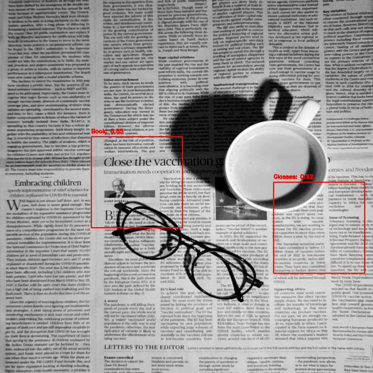

# Проект по обнаружению объектов на картинках через YOLOv8


## Описание

В проекте обучена модель YOLOv8, с помощью которой на картинке выделяется объект, часто два или три. Объектом может выступать кружка, книга или очки

## Запуск

1. **Клонируйте репозиторий**:
   ```bash
   git clone https://github.com/Gustavs3n22/KT_CV_YOLOv8.git
   cd yolov8-object-detection
   
2. **Войдите в папку с клонированным репозиторием** 
запустите следующую строчку в cmd (ЭТОТ ШАГ МОЖНО ПРОПУСТИТЬ):
   ```bash
	yolo task=detect mode=train model=yolov8n.pt data=data.yaml epochs=50 imgsz=640

После обучения модели, она сохранится автоматически.

Войдите в ipynb записку и запустите ячейки, вы получите предсказание на текущую настройку модели. Обновите пути в ячейках для смены картинки и предсказания
